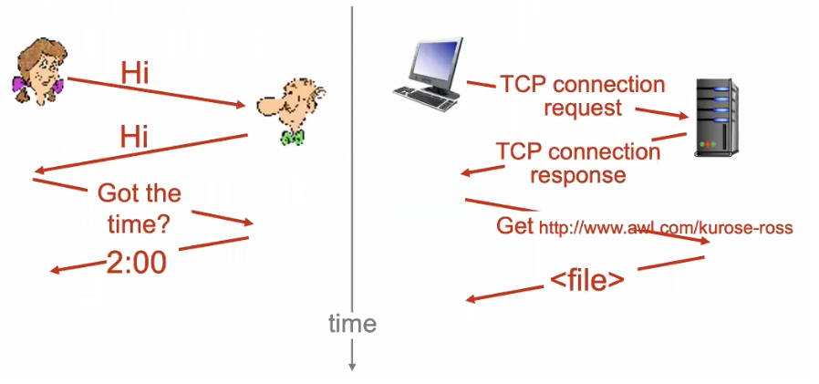
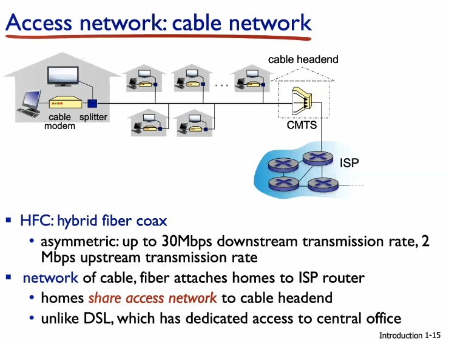
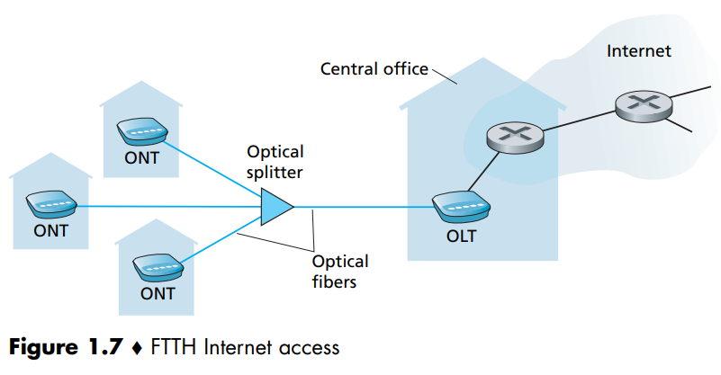

<h1> Glossário </h1>

<h2> Conceitos: </h2>

<strong>Protocol: </strong> Protocolos definem formato, ordem de mensagens que podem ser enviadas e recebidas entre entidades de rede, e ações realizadas na recepção e na transmissão de mensagens. Tudo isso especificado de forma não ambigua. Toda comunicação na internet é governada por protocolos.

<h2> Siglas: </h2>

<strong>API: </strong> Application Programming
Interface, specifies how a program running on one end system asks
the Internet infrastructure to deliver data to a specific destination program running on another end system. This Internet API is a set of rules that the sending
program must follow so that the Internet can deliver the data to the destination program.

<strong>CMTS: </strong> Cable Modem Termination System, cable headend, usado em sistemas de rede a cabo (cable network) para ligar o cabo coaxial de uma rua ou de um bairro ao ISP. Similar ao DSLAM na DSL, ele transforma o sinal analogico dos modems a cabo em sinal digital.  

<strong>DSL: </strong> Digital Subscriber Line, one of the 2 most prevalent types of broadband residential access (the other is cable).  

<strong>DSLAM: </strong> Digital Subscriber Line Access Multiplexer, equipamento localizado no Central Office, que faz a separação do sinal de telefonia (operação no dominio da frequencia), mandando a parte do sinal referente ao telefone para a telephone network, e a parte relativa a dados é encaminhada ao ISP, que o redireciona à internet.  

<strong>FIOS: </strong> A FTTH Service provided by Verizon.  

<strong>FTTH: </strong> Fiber to The Home, as the name suggests, the FTTH concept is simple: provide an optical fiber path from the CO directly to the home.  

<strong>HFC: </strong> Hybrid fiber coax  

<strong>ISP: </strong> Internet Service Providers,  residential ISPs such as local cable or telephone companies; corporate ISPs; university ISPs; and ISPs that provide WiFi access in airports, hotels, coffee shops, and other public places. Each ISP is in itself a network of packet switches
and communication links. ISPs provide a variety of types of network access to the
end systems, including residential broadband access such as cable modem or DSL, high-speed local area network access, wireless access, and 56 kbps dial-up modem access. ISPs also provide Internet access to content providers, connecting Web sites directly to the Internet. The Internet is all about connecting end systems to each other, so the ISPs that provide access to end systems must also be interconnected. These lower-tier ISPs are interconnected through national and international upper-tier ISPs such as Level 3 Communications, AT&T, Sprint, and NTT.
An upper-tier ISP consists of high-speed routers interconnected with high-speed
fiber-optic links. Each ISP network, whether upper-tier or lower-tier, is managed independently, runs the IP protocol (see below), and conforms to certain naming
and address conventions. 

<strong>LAN: </strong> Local Area Network. Ethernet is an example of it. WiFi is Wireless LAN access based on IEEE 802.11

<strong>LEO: </strong> Low earth orbiting satellites, twisted pair copper wire sem proteção, geralmente usado em redes internas, LANs.

<strong>NAT: </strong> Network Address translation service

<strong>PON: </strong> Passive Optical Networks, an optical-distribution network architectures that perform the splitting of a shared FTTH cable to multiple houses. Used in Verizon's FIOS service. 

<strong>RFCs: </strong> Requests for Comments, started out as general requests for comments (hence the name) to resolve network and protocol design problems that faced the precursor to the Internet [Allman 2011]. RFCs tend to be quite technical and detailed. They define protocols such as TCP, IP,
HTTP (for the Web), and SMTP (for e-mail). There are currently more than 6,000 RFCs. Other bodies also specify standards for network components, most notably for network links. The IEEE 802 LAN/MAN Standards Committee [IEEE 802 2012], for example, specifies the Ethernet and wireless WiFi standards.

<strong>TCP/IP: </strong> Transmission Control Protocol and Internet Protocol, two ofthe most important protocols in the Internet. The IP protocol specifies the format of the packets that are sent and received among routers and end systems. The Internet’s principal protocols are collectively known as TCP/IP. 

<strong>UTP: </strong> Unshielded twisted pair, twisted pair copper wire sem proteção, geralmente usado em redes internas, LANs.

<h2> Materiais: </h2>

<strong>Twisted-Pair Copper Wire: </strong> o meio de transmissão guiado mais barato e mais utilizado. Usado há muito tempo nas redes de telefone. Consiste em dois fios de cobre isolados, cada um com cerca de 1 mm de espessura, dispostos de forma regular padrão em espiral.

<strong>Coaxial Cable: </strong> Assim como Twisted-Pair Copper Wire, consiste em 2 condutores de cobre, mas eles são concêntricos ao invés de paralelos. Muito comum em sistemas de televisão a cabo.

<strong>Fiber Optics: </strong> É um meio fino e flexível que conduz pulsos de luz, cada um representando um bit. Transportam taxas extremas de bits, como dezenas ou centenas de gigabits por segundo.

<strong>Terrestrial Radio Channels: </strong> Carregam sinais no espectro eletromagnético. Não requerem que fio seja instalado, podem penetrar paredes, proveem conectividade para usuarios mobile e podem potencialmente carregar sinal por longas distancias. Suas características dependem bastante do ambiente de propagação e da distância.

<strong>Satellite Radio Channels: </strong> A communication satellite links two or more Earth-based microwave transmitter/receivers, known as ground stations. The satellite receives transmissions on one frequency band, regenerates the signal using a repeater (discussed below), and transmits the signal on another frequency. Two types of satellites are used in communications: geostationary satellites and low-earth orbiting (LEO) satellites. Geostationary satellites permanently remain above the same spot on Earth. This stationary presence is achieved by placing the satellite in orbit at 36,000 kilometers
above Earth’s surface. This distance creates a delay of 280 miliseconds.

