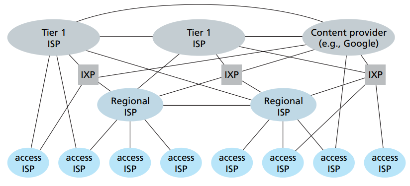
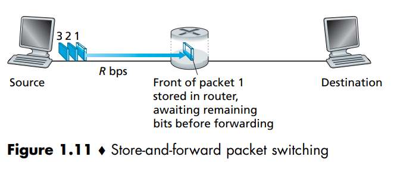

<h1> Glossário </h1>

<h2>Images interessantes: </h2>

Network level 5 (internet de 2012)     

<h2> Conceitos: </h2>

**Protocol:** Protocolos definem formato, ordem de mensagens que podem ser enviadas e recebidas entre entidades de rede, e ações realizadas na recepção e na transmissão de mensagens. Tudo isso especificado de forma não ambigua. Toda comunicação na internet é governada por protocolos. 
  

**Packet Switch:** Routers and link-layer switches. To send a message from a source end system to a destination end system, the source breaks long messages into smaller chunks of data known as packets. Between source and destination, each packet travels through communication links and packet switches (for which there are two predominant types, routers and linklayer switches). Packets are transmitted over each communication link at a rate equal to the full transmission rate of the link. So, if a source end system or a packet switch is sending a packet of L bits over a link with transmission rate R bits/sec, then the time to transmit the packet is L/R seconds.

**Packet switching vs Circuit switching:** Two fundamental approaches to moving data through a network of links and switches. Packet switching = restaurant that doesn't require/accept reservations. Circuit switching = restaurant that requires reservation. On the 1st you don't have to bother to reserve, but we may need to wait (queue of packets waiting for output link). On the 2nd we need to reserve previously, but when we get there, we just sit and eat.

**Store-and-Forward Transmission:** Most packet switches use store-and-forward transmission at the inputs to thelinks. Store-and-forward transmission means that the packet switch must receive the entire packet before it can begin to transmit the first bit of the packet onto the outbound link.

L/R é o tempo que cada caminho leva

delay-end-to-end = numero_de_caminhos*L/R

<h2> Siglas: </h2>

**API:** Application Programming
Interface, specifies how a program running on one end system asks
the Internet infrastructure to deliver data to a specific destination program running on another end system. This Internet API is a set of rules that the sending
program must follow so that the Internet can deliver the data to the destination program.

**CMTS:** Cable Modem Termination System, cable headend, usado em sistemas de rede a cabo (cable network) para ligar o cabo coaxial de uma rua ou de um bairro ao ISP. Similar ao DSLAM na DSL, ele transforma o sinal analogico dos modems a cabo em sinal digital.  

**DSL:** Digital Subscriber Line, one of the 2 most prevalent types of broadband residential access (the other is cable).  

**DSLAM:** Digital Subscriber Line Access Multiplexer, equipamento localizado no Central Office, que faz a separação do sinal de telefonia (operação no dominio da frequencia), mandando a parte do sinal referente ao telefone para a telephone network, e a parte relativa a dados é encaminhada ao ISP, que o redireciona à internet.  

**FDM:** Frequency-Division Multiplexing, a way of implementing a circuit in a link, where the frequency spectrum of a link is divided up among the connections established across the link. 

**FIOS:** A FTTH Service provided by Verizon.  

**FTTH:** Fiber to The Home, as the name suggests, the FTTH concept is simple: provide an optical fiber path from the CO directly to the home.  

**HFC:** Hybrid fiber coax  

**ISP:** Internet Service Providers,  residential ISPs such as local cable or telephone companies; corporate ISPs; university ISPs; and ISPs that provide WiFi access in airports, hotels, coffee shops, and other public places. Each ISP is in itself a network of packet switches
and communication links. ISPs provide a variety of types of network access to the
end systems, including residential broadband access such as cable modem or DSL, high-speed local area network access, wireless access, and 56 kbps dial-up modem access. ISPs also provide Internet access to content providers, connecting Web sites directly to the Internet. The Internet is all about connecting end systems to each other, so the ISPs that provide access to end systems must also be interconnected. These lower-tier ISPs are interconnected through national and international upper-tier ISPs such as Level 3 Communications, AT&T, Sprint, and NTT.
An upper-tier ISP consists of high-speed routers interconnected with high-speed
fiber-optic links. Each ISP network, whether upper-tier or lower-tier, is managed independently, runs the IP protocol (see below), and conforms to certain naming
and address conventions. 

**IXP**: Internet Exchange
Point, a meeting point where multiple ISPs can peer together.

**LAN:** Local Area Network. Ethernet is an example of it. WiFi is Wireless LAN access based on IEEE 802.11.

**LEO:** Low earth orbiting satellites, twisted pair copper wire sem proteção, geralmente usado em redes internas, LANs.

**NAT:** Network Address translation service

**PON:** Passive Optical Networks, an optical-distribution network architectures that perform the splitting of a shared FTTH cable to multiple houses. Used in Verizon's FIOS service. 

**RFCs:** Requests for Comments, started out as general requests for comments (hence the name) to resolve network and protocol design problems that faced the precursor to the Internet [Allman 2011]. RFCs tend to be quite technical and detailed. They define protocols such as TCP, IP,
HTTP (for the Web), and SMTP (for e-mail). There are currently more than 6,000 RFCs. Other bodies also specify standards for network components, most notably for network links. The IEEE 802 LAN/MAN Standards Committee [IEEE 802 2012], for example, specifies the Ethernet and wireless WiFi standards.

**TCP/IP:** Transmission Control Protocol and Internet Protocol, two ofthe most important protocols in the Internet. The IP protocol specifies the format of the packets that are sent and received among routers and end systems. The Internet’s principal protocols are collectively known as TCP/IP. 

**TDM:** Time-Division Multiplexing, a way of implementing a circuit in a link. 

**UTP:** Unshielded twisted pair, twisted pair copper wire sem proteção, geralmente usado em redes internas, LANs.

<h2> Materiais: </h2>

**Twisted-Pair Copper Wire:** o meio de transmissão guiado mais barato e mais utilizado. Usado há muito tempo nas redes de telefone. Consiste em dois fios de cobre isolados, cada um com cerca de 1 mm de espessura, dispostos de forma regular padrão em espiral.

**Coaxial Cable:** Assim como Twisted-Pair Copper Wire, consiste em 2 condutores de cobre, mas eles são concêntricos ao invés de paralelos. Muito comum em sistemas de televisão a cabo.

**Fiber Optics:** É um meio fino e flexível que conduz pulsos de luz, cada um representando um bit. Transportam taxas extremas de bits, como dezenas ou centenas de gigabits por segundo.

**Terrestrial Radio Channels:** Carregam sinais no espectro eletromagnético. Não requerem que fio seja instalado, podem penetrar paredes, proveem conectividade para usuarios mobile e podem potencialmente carregar sinal por longas distancias. Suas características dependem bastante do ambiente de propagação e da distância.

**Satellite Radio Channels:** A communication satellite links two or more Earth-based microwave transmitter/receivers, known as ground stations. The satellite receives transmissions on one frequency band, regenerates the signal using a repeater (discussed below), and transmits the signal on another frequency. Two types of satellites are used in communications: geostationary satellites and low-earth orbiting (LEO) satellites. Geostationary satellites permanently remain above the same spot on Earth. This stationary presence is achieved by placing the satellite in orbit at 36,000 kilometers
above Earth’s surface. This distance creates a delay of 280 miliseconds.

